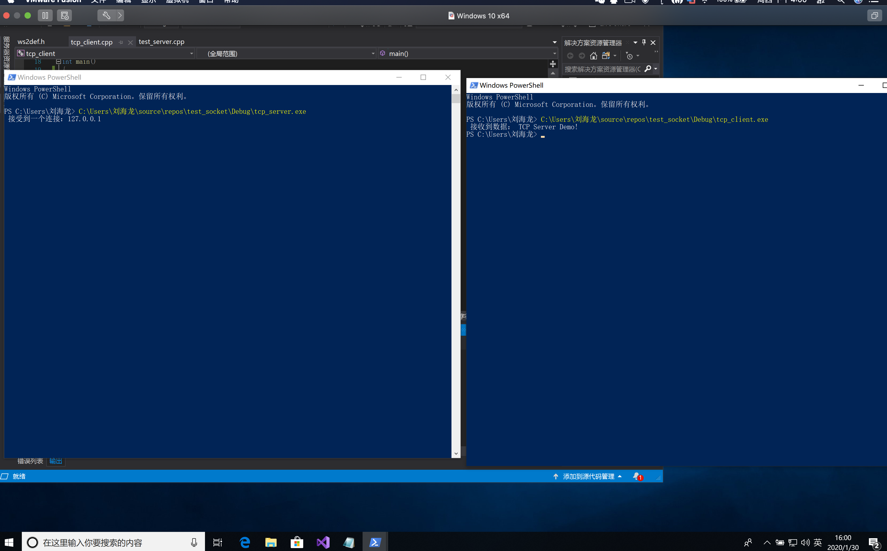
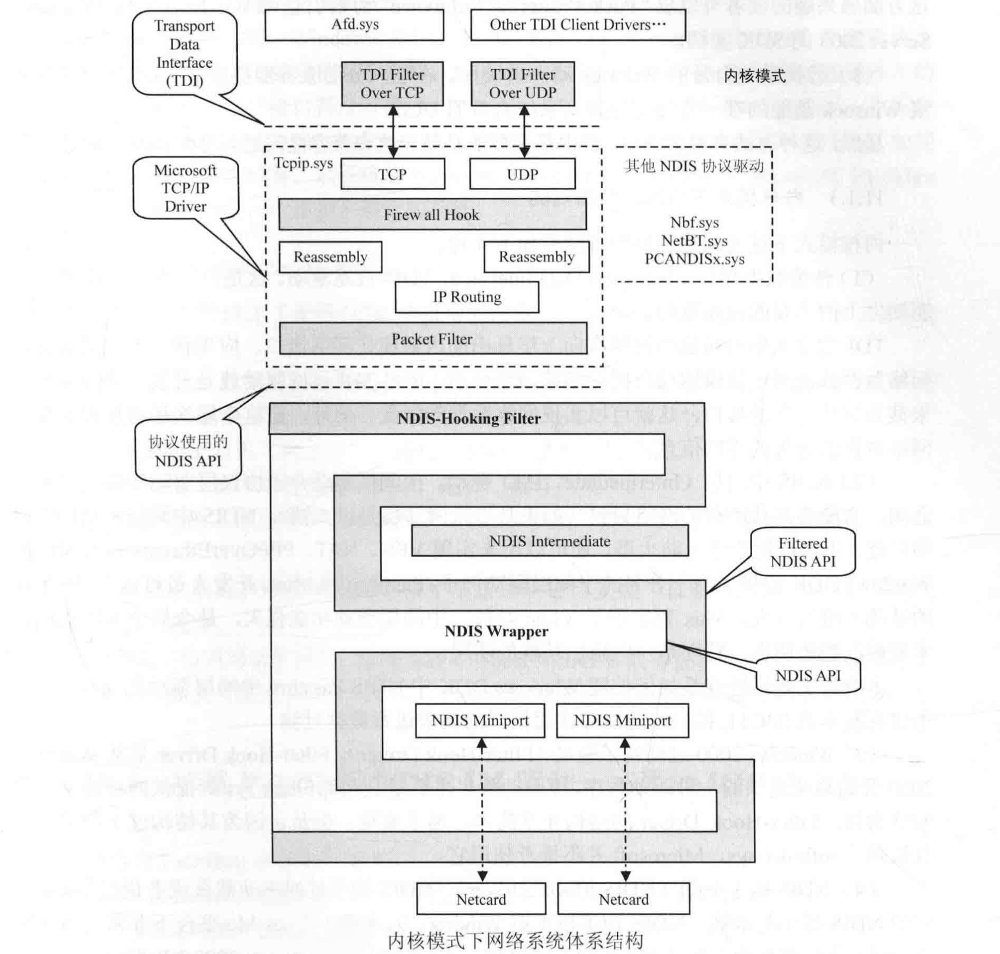
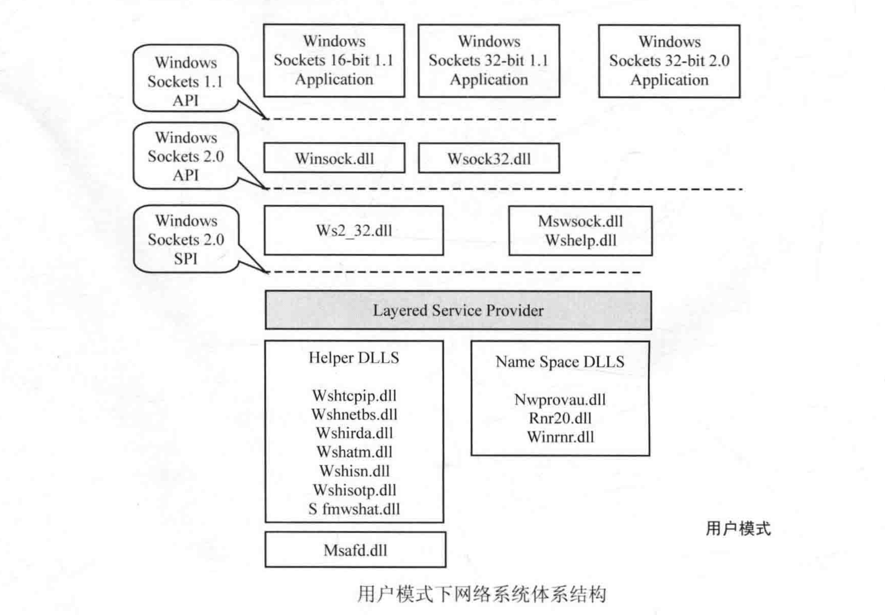
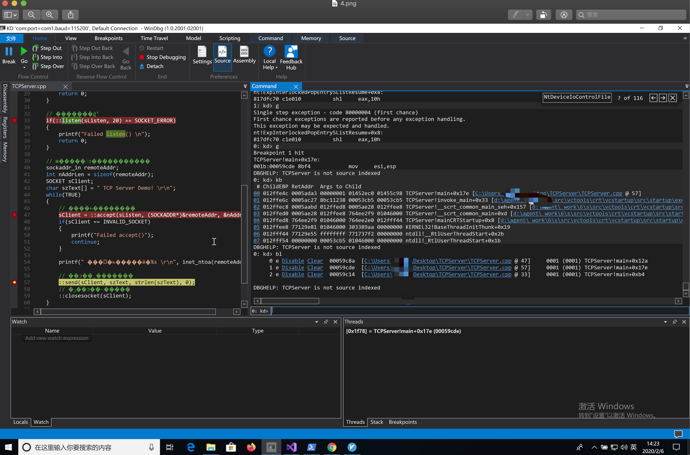
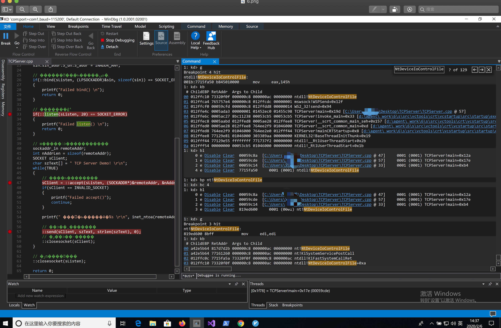
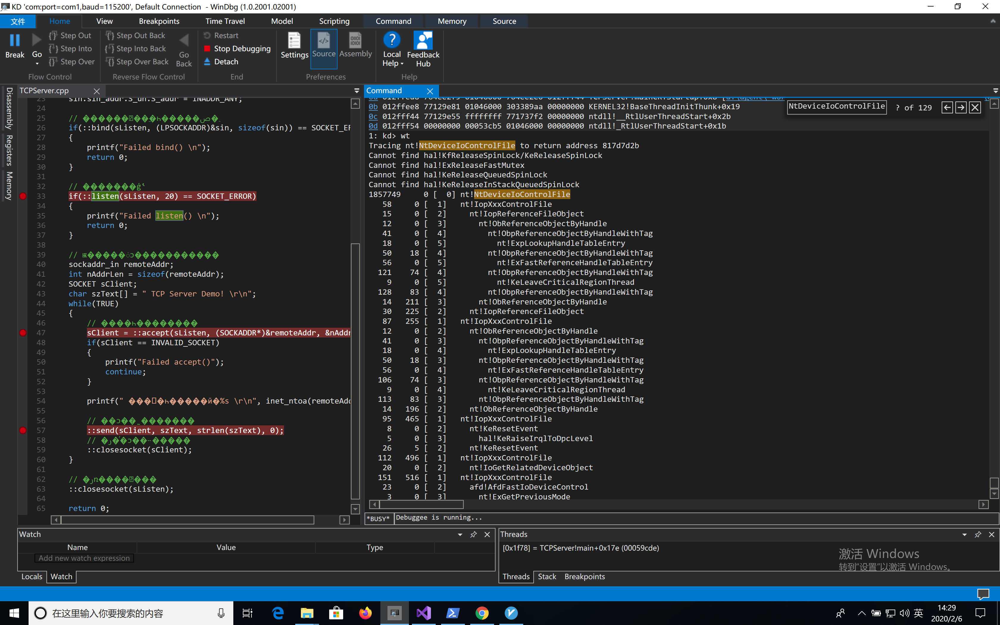

# 第一课 网络基础(socket)



```
//切入进程
.process /p /r /i ffff8a8c043bc500 
//加载符号
.reload 
//一定确实ws2_32符号加载成功
bp ws2_32!send
bp WS2_32!recv
bp ntdll!ZwDeviceIoControlFile ".if(poi(ebp+8)=0x8c){}.else{gc}"
bp nt!NtDeviceIoControlFile ".if(poi(ebp+8)=0x8c){}.else{gc}"
```
* 查看第一个参数（句柄）  
```
可下条件断点
bp ntdll!ZwDeviceIoControlFile ".if(poi(ebp+8)=0x8c){}.else{gc}"
bp nt!NtDeviceIoControlFile ".if(poi(ebp+8)=0x8c){}.else{gc}"
0:000> g
Breakpoint 4 hit
eax=010ffab8 ebx=00000000 ecx=010ffac8 edx=00000000 esi=00000000 edi=00000000
eip=733adc11 esp=010ffa80 ebp=010ffb04 iopl=0         nv up ei pl zr na pe nc
cs=0023  ss=002b  ds=002b  es=002b  fs=0053  gs=002b             efl=00000246
mswsock!sethostname+0xd221:
733adc11 ff1574a33d73    call    dword ptr [mswsock!Tcpip6_WSHStringToAddress+0x1c584 (733da374)] ds:002b:733da374={ntdll!ZwDeviceIoControlFile (772304f0)}
0:000> kb
 # ChildEBP RetAddr  Args to Child              
WARNING: Stack unwind information not available. Following frames may be wrong.
00 010ffb04 751557e4 00000160 010ffb3c 00000001 mswsock!sethostname+0xd221
01 010ffb50 00029cfd 00000160 010ffc38 00000014 WS2_32!send+0x94
02 010ffcac 0002ada3 00000001 0015d678 00163418 TCPServer!main+0x19d [C:\Users\刘海龙\Desktop\TCPServer\TCPServer.cpp @ 57] 
03 010ffccc 0002ac27 d7a8c11b 00023cb5 00023cb5 TCPServer!invoke_main+0x33 [d:\agent\_work\6\s\src\vctools\crt\vcstartup\src\startup\exe_common.inl @ 78] 
04 010ffd28 0002aabd 010ffd38 0002ae28 010ffd48 TCPServer!__scrt_common_main_seh+0x157 [d:\agent\_work\6\s\src\vctools\crt\vcstartup\src\startup\exe_common.inl @ 288] 
05 010ffd30 0002ae28 010ffd48 76dc0419 00e8c000 TCPServer!__scrt_common_main+0xd [d:\agent\_work\6\s\src\vctools\crt\vcstartup\src\startup\exe_common.inl @ 331] 
06 010ffd38 76dc0419 00e8c000 76dc0400 010ffda4 TCPServer!mainCRTStartup+0x8 [d:\agent\_work\6\s\src\vctools\crt\vcstartup\src\startup\exe_main.cpp @ 17] 
07 010ffd48 7722662d 00e8c000 13a35d52 00000000 KERNEL32!BaseThreadInitThunk+0x19
08 010ffda4 772265fd ffffffff 772451ca 00000000 ntdll!RtlGetAppContainerNamedObjectPath+0xed
09 010ffdb4 00000000 00023cb5 00e8c000 00000000 ntdll!RtlGetAppContainerNamedObjectPath+0xbd
0:000> dd 751557e4
751557e4  c983f08b c10ff0ff 2a840f0f 85000153
751557f4  3c850ff6 8b000153 5e5ff445 5de58b5b
75155804  390010c2 1954901d 5c840f75 ffffffff
75155814  19504835 d015ff75 89751961 c085f845
75155824  52c0840f 5d890001 ff61e9fc ff8bffff
75155834  56f18b56 549835ff cde87519 85000000
75155844  5e0274c0 5ece8bc3 026efee9 cccccc00
75155854  cccccccc cccccccc cccccccc 8b55ff8b
```
# 追踪accept
```
//判断第一个参数句柄 
0x000000c8
//accept
00 012ffa64 7331855b 000000b0 000000ac 00000000 ntdll!NtDeviceIoControlFile
bp ntdll!ZwDeviceIoControlFile ".if(poi(ebp+8)=0x15c){}.else{gc}"
bp nt!NtDeviceIoControlFile ".if(poi(ebp+8)=0x118){}.else{gc}"

1: kd> g
Breakpoint 0 hit
TCPServer!main+0x12a:
001b:00059c8a 8bf4            mov     esi,esp
DBGHELP: TCPServer is not source indexed
1: kd> bl
     0 e Disable Clear  00059c8a  [C:\Users\刘海龙\Desktop\TCPServer\TCPServer.cpp @ 47]     0001 (0001) TCPServer!main+0x12a
     1 e Disable Clear  00059cde  [C:\Users\刘海龙\Desktop\TCPServer\TCPServer.cpp @ 57]     0001 (0001) TCPServer!main+0x17e
     2 e Disable Clear  00059c14  [C:\Users\刘海龙\Desktop\TCPServer\TCPServer.cpp @ 33]     0001 (0001) TCPServer!main+0xb4
     4 e Disable Clear  7715fa50     0001 (0001) ntdll!NtDeviceIoControlFile

DBGHELP: TCPServer is not source indexed
1: kd> bc 4
DBGHELP: TCPServer is not source indexed
1: kd> bp WS2_32!accept
DBGHELP: TCPServer is not source indexed
1: kd> g
Breakpoint 3 hit
WS2_32!accept:
001b:76574ae0 8bff            mov     edi,edi
1: kd> .process
Implicit process is now 943c3980
1: kd> bp ntdll!NtDeviceIoControlFile
1: kd> bl
     0 e Disable Clear  00059c8a  [C:\Users\刘海龙\Desktop\TCPServer\TCPServer.cpp @ 47]     0001 (0001) TCPServer!main+0x12a
     1 e Disable Clear  00059cde  [C:\Users\刘海龙\Desktop\TCPServer\TCPServer.cpp @ 57]     0001 (0001) TCPServer!main+0x17e
     2 e Disable Clear  00059c14  [C:\Users\刘海龙\Desktop\TCPServer\TCPServer.cpp @ 33]     0001 (0001) TCPServer!main+0xb4
     3 e Disable Clear  76574ae0     0001 (0001) WS2_32!accept
     4 e Disable Clear  7715fa50     0001 (0001) ntdll!NtDeviceIoControlFile

1: kd> bc 3
1: kd> bl
     0 e Disable Clear  00059c8a  [C:\Users\刘海龙\Desktop\TCPServer\TCPServer.cpp @ 47]     0001 (0001) TCPServer!main+0x12a
     1 e Disable Clear  00059cde  [C:\Users\刘海龙\Desktop\TCPServer\TCPServer.cpp @ 57]     0001 (0001) TCPServer!main+0x17e
     2 e Disable Clear  00059c14  [C:\Users\刘海龙\Desktop\TCPServer\TCPServer.cpp @ 33]     0001 (0001) TCPServer!main+0xb4
     4 e Disable Clear  7715fa50     0001 (0001) ntdll!NtDeviceIoControlFile

1: kd> g
Breakpoint 4 hit
ntdll!NtDeviceIoControlFile:
001b:7715fa50 b845010000      mov     eax,145h
1: kd> bp nt!NtDeviceIoControlFile
1: kd> kb
 # ChildEBP RetAddr  Args to Child              
00 012ffa64 7331855b 000000b0 000000ac 00000000 ntdll!NtDeviceIoControlFile
01 012ffca0 76574b8f 000000b0 012ffe10 012ffe04 mswsock!WSPAccept+0x1db
02 012ffcd8 76574af7 000000b0 012ffe10 012ffe04 WS2_32!WSAAccept+0x8f
03 012ffcf4 00059c9e 000000b0 012ffe10 012ffe04 WS2_32!accept+0x17
04 012ffe4c 0005ada3 00000001 01452ec0 01455c98 TCPServer!main+0x13e [C:\Users\刘海龙\Desktop\TCPServer\TCPServer.cpp @ 47] 
05 012ffe6c 0005ac27 8bc11238 00053cb5 00053cb5 TCPServer!invoke_main+0x33 [d:\agent\_work\6\s\src\vctools\crt\vcstartup\src\startup\exe_common.inl @ 78] 
06 012ffec8 0005aabd 012ffed8 0005ae28 012ffee8 TCPServer!__scrt_common_main_seh+0x157 [d:\agent\_work\6\s\src\vctools\crt\vcstartup\src\startup\exe_common.inl @ 288] 
07 012ffed0 0005ae28 012ffee8 764ee2f9 01046000 TCPServer!__scrt_common_main+0xd [d:\agent\_work\6\s\src\vctools\crt\vcstartup\src\startup\exe_common.inl @ 331] 
08 012ffed8 764ee2f9 01046000 764ee2e0 012fff44 TCPServer!mainCRTStartup+0x8 [d:\agent\_work\6\s\src\vctools\crt\vcstartup\src\startup\exe_main.cpp @ 17] 
09 012ffee8 77129e81 01046000 303389aa 00000000 KERNEL32!BaseThreadInitThunk+0x19
0a 012fff44 77129e55 ffffffff 771737f2 00000000 ntdll!__RtlUserThreadStart+0x2b
0b 012fff54 00000000 00053cb5 01046000 00000000 ntdll!_RtlUserThreadStart+0x1b
1: kd> .process
Implicit process is now 943c3980
1: kd> bl
     0 e Disable Clear  00059c8a  [C:\Users\刘海龙\Desktop\TCPServer\TCPServer.cpp @ 47]     0001 (0001) TCPServer!main+0x12a
     1 e Disable Clear  00059cde  [C:\Users\刘海龙\Desktop\TCPServer\TCPServer.cpp @ 57]     0001 (0001) TCPServer!main+0x17e
     2 e Disable Clear  00059c14  [C:\Users\刘海龙\Desktop\TCPServer\TCPServer.cpp @ 33]     0001 (0001) TCPServer!main+0xb4
     3 e Disable Clear  819ed600     0001 (0001) nt!NtDeviceIoControlFile
     4 e Disable Clear  7715fa50     0001 (0001) ntdll!NtDeviceIoControlFile

1: kd> bc 4
1: kd> bc 3
1: kd> bp nt!NtDeviceIoControlFile
1: kd> bl
     0 e Disable Clear  00059c8a  [C:\Users\刘海龙\Desktop\TCPServer\TCPServer.cpp @ 47]     0001 (0001) TCPServer!main+0x12a
     1 e Disable Clear  00059cde  [C:\Users\刘海龙\Desktop\TCPServer\TCPServer.cpp @ 57]     0001 (0001) TCPServer!main+0x17e
     2 e Disable Clear  00059c14  [C:\Users\刘海龙\Desktop\TCPServer\TCPServer.cpp @ 33]     0001 (0001) TCPServer!main+0xb4
     3 e Disable Clear  819ed600     0001 (0001) nt!NtDeviceIoControlFile

1: kd> g
Breakpoint 3 hit
nt!NtDeviceIoControlFile:
819ed600 8bff            mov     edi,edi
1: kd> kb
 # ChildEBP RetAddr  Args to Child              
00 a42e5b64 817d7d2b 000000b0 000000ac 00000000 nt!NtDeviceIoControlFile
01 a42e5b64 77161260 000000b0 000000ac 00000000 nt!KiSystemServicePostCall
02 012ffa60 7715fa5a 7331855b 000000b0 000000ac ntdll!KiFastSystemCallRet
03 012ffa64 7331855b 000000b0 000000ac 00000000 ntdll!NtDeviceIoControlFile+0xa
04 012ffca0 76574b8f 000000b0 012ffe10 012ffe04 mswsock!WSPAccept+0x1db
05 012ffcd8 76574af7 000000b0 012ffe10 012ffe04 WS2_32!WSAAccept+0x8f
06 012ffcf4 00059c9e 000000b0 012ffe10 012ffe04 WS2_32!accept+0x17
07 012ffe4c 0005ada3 00000001 01452ec0 01455c98 TCPServer!main+0x13e [C:\Users\刘海龙\Desktop\TCPServer\TCPServer.cpp @ 47] 
08 012ffe6c 0005ac27 8bc11238 00053cb5 00053cb5 TCPServer!invoke_main+0x33 [d:\agent\_work\6\s\src\vctools\crt\vcstartup\src\startup\exe_common.inl @ 78] 
09 012ffec8 0005aabd 012ffed8 0005ae28 012ffee8 TCPServer!__scrt_common_main_seh+0x157 [d:\agent\_work\6\s\src\vctools\crt\vcstartup\src\startup\exe_common.inl @ 288] 
0a 012ffed0 0005ae28 012ffee8 764ee2f9 01046000 TCPServer!__scrt_common_main+0xd [d:\agent\_work\6\s\src\vctools\crt\vcstartup\src\startup\exe_common.inl @ 331] 
0b 012ffed8 764ee2f9 01046000 764ee2e0 012fff44 TCPServer!mainCRTStartup+0x8 [d:\agent\_work\6\s\src\vctools\crt\vcstartup\src\startup\exe_main.cpp @ 17] 
0c 012ffee8 77129e81 01046000 303389aa 00000000 KERNEL32!BaseThreadInitThunk+0x19
0d 012fff44 77129e55 ffffffff 771737f2 00000000 ntdll!__RtlUserThreadStart+0x2b
0e 012fff54 00000000 00053cb5 01046000 00000000 ntdll!_RtlUserThreadStart+0x1b
1: kd> wt
Tracing nt!NtDeviceIoControlFile to return address 817d7d2b
Cannot find hal!KfReleaseSpinLock/KeReleaseSpinLock
Cannot find hal!ExReleaseFastMutex
Cannot find hal!KeReleaseQueuedSpinLock
Cannot find hal!KeReleaseInStackQueuedSpinLock
473171     0 [  0] nt!NtDeviceIoControlFile
   51     0 [  1]   nt!IopXxxControlFile
   27     0 [  2]     nt!ProbeForWrite
   70    27 [  1]   nt!IopXxxControlFile
   15     0 [  2]     nt!IopReferenceFileObject
   12     0 [  3]       nt!ObReferenceObjectByHandle
   41     0 [  4]         nt!ObpReferenceObjectByHandleWithTag
   18     0 [  5]           nt!ExpLookupHandleTableEntry
   50    18 [  4]         nt!ObpReferenceObjectByHandleWithTag
   56     0 [  5]           nt!ExFastReferenceHandleTableEntry
  121    74 [  4]         nt!ObpReferenceObjectByHandleWithTag
    9     0 [  5]           nt!KeLeaveCriticalRegionThread
  128    83 [  4]         nt!ObpReferenceObjectByHandleWithTag
   14   211 [  3]       nt!ObReferenceObjectByHandle
   30   225 [  2]     nt!IopReferenceFileObject
   99   282 [  1]   nt!IopXxxControlFile
   12     0 [  2]     nt!ObReferenceObjectByHandle
   41     0 [  3]       nt!ObpReferenceObjectByHandleWithTag
   18     0 [  4]         nt!ExpLookupHandleTableEntry
   50    18 [  3]       nt!ObpReferenceObjectByHandleWithTag
   56     0 [  4]         nt!ExFastReferenceHandleTableEntry
  106    74 [  3]       nt!ObpReferenceObjectByHandleWithTag
    9     0 [  4]         nt!KeLeaveCriticalRegionThread
  113    83 [  3]       nt!ObpReferenceObjectByHandleWithTag
   14   196 [  2]     nt!ObReferenceObjectByHandle
  107   492 [  1]   nt!IopXxxControlFile
    8     0 [  2]     nt!KeResetEvent
    5     0 [  3]       hal!KeRaiseIrqlToDpcLevel
   26     5 [  2]     nt!KeResetEvent
  124   523 [  1]   nt!IopXxxControlFile
SYMSRV:  BYINDEX: 0x3AC
         c:\symbols*http://msdl.microsoft.com/download/symbols
         afd.pdb
         2086CFEB716E5E532B66BA50689014E81
SYMSRV:  PATH: c:\symbols\afd.pdb\2086CFEB716E5E532B66BA50689014E81\afd.pdb
SYMSRV:  RESULT: 0x00000000
DBGHELP: afd - public symbols  
        c:\symbols\afd.pdb\2086CFEB716E5E532B66BA50689014E81\afd.pdb
   20     0 [  2]     nt!IoGetRelatedDeviceObject
  169   543 [  1]   nt!IopXxxControlFile
   23     0 [  2]     afd!AfdFastIoDeviceControl
    3     0 [  3]       nt!ExGetPreviousMode
   59     3 [  2]     afd!AfdFastIoDeviceControl
  177   605 [  1]   nt!IopXxxControlFile
   10     0 [  2]     nt!IopResetEvent
    5     0 [  3]       hal!KeRaiseIrqlToDpcLevel
   24     5 [  2]     nt!IopResetEvent
  187   634 [  1]   nt!IopXxxControlFile
   11     0 [  2]     nt!IopAllocateIrpExReturn
   75     0 [  3]       nt!IopAllocateIrpPrivate
    6     0 [  4]         nt!ExInterlockedPopEntrySList
```

# 追踪send



```
1: kd> bc 3
1: kd> g
Break instruction exception - code 80000003 (first chance)
*******************************************************************************
*                                                                             *
*   You are seeing this message because you pressed either                    *
*       CTRL+C (if you run console kernel debugger) or,                       *
*       CTRL+BREAK (if you run GUI kernel debugger),                          *
*   on your debugger machine's keyboard.                                      *
*                                                                             *
*                   THIS IS NOT A BUG OR A SYSTEM CRASH                       *
*                                                                             *
* If you did not intend to break into the debugger, press the "g" key, then   *
* press the "Enter" key now.  This message might immediately reappear.  If it *
* does, press "g" and "Enter" again.                                          *
*                                                                             *
*******************************************************************************
nt!RtlpBreakWithStatusInstruction:
817c6cd4 cc              int     3
1: kd> g
Single step exception - code 80000004 (first chance)
First chance exceptions are reported before any exception handling.
This exception may be expected and handled.
nt!ExpInterlockedPopEntrySListResume+0x8:
817dfc70 c1e010          shl     eax,10h
1: kd> g
Single step exception - code 80000004 (first chance)
First chance exceptions are reported before any exception handling.
This exception may be expected and handled.
nt!ExpInterlockedPopEntrySListResume+0x8:
817dfc70 c1e010          shl     eax,10h
0: kd> g
Breakpoint 1 hit
TCPServer!main+0x17e:
001b:00059cde 8bf4            mov     esi,esp
DBGHELP: TCPServer is not source indexed
0: kd> kb
 # ChildEBP RetAddr  Args to Child              
00 012ffe4c 0005ada3 00000001 01452ec0 01455c98 TCPServer!main+0x17e [C:\Users\刘海龙\Desktop\TCPServer\TCPServer.cpp @ 57] 
01 012ffe6c 0005ac27 8bc11238 00053cb5 00053cb5 TCPServer!invoke_main+0x33 [d:\agent\_work\6\s\src\vctools\crt\vcstartup\src\startup\exe_common.inl @ 78] 
02 012ffec8 0005aabd 012ffed8 0005ae28 012ffee8 TCPServer!__scrt_common_main_seh+0x157 [d:\agent\_work\6\s\src\vctools\crt\vcstartup\src\startup\exe_common.inl @ 288] 
03 012ffed0 0005ae28 012ffee8 764ee2f9 01046000 TCPServer!__scrt_common_main+0xd [d:\agent\_work\6\s\src\vctools\crt\vcstartup\src\startup\exe_common.inl @ 331] 
04 012ffed8 764ee2f9 01046000 764ee2e0 012fff44 TCPServer!mainCRTStartup+0x8 [d:\agent\_work\6\s\src\vctools\crt\vcstartup\src\startup\exe_main.cpp @ 17] 
05 012ffee8 77129e81 01046000 303389aa 00000000 KERNEL32!BaseThreadInitThunk+0x19
06 012fff44 77129e55 ffffffff 771737f2 00000000 ntdll!__RtlUserThreadStart+0x2b
07 012fff54 00000000 00053cb5 01046000 00000000 ntdll!_RtlUserThreadStart+0x1b
DBGHELP: TCPServer is not source indexed
0: kd> bl
     0 e Disable Clear  00059c8a  [C:\Users\刘海龙\Desktop\TCPServer\TCPServer.cpp @ 47]     0001 (0001) TCPServer!main+0x12a
     1 e Disable Clear  00059cde  [C:\Users\刘海龙\Desktop\TCPServer\TCPServer.cpp @ 57]     0001 (0001) TCPServer!main+0x17e
     2 e Disable Clear  00059c14  [C:\Users\刘海龙\Desktop\TCPServer\TCPServer.cpp @ 33]     0001 (0001) TCPServer!main+0xb4

DBGHELP: TCPServer is not source indexed
0: kd> bl
     0 e Disable Clear  00059c8a  [C:\Users\刘海龙\Desktop\TCPServer\TCPServer.cpp @ 47]     0001 (0001) TCPServer!main+0x12a
     1 e Disable Clear  00059cde  [C:\Users\刘海龙\Desktop\TCPServer\TCPServer.cpp @ 57]     0001 (0001) TCPServer!main+0x17e
     2 e Disable Clear  00059c14  [C:\Users\刘海龙\Desktop\TCPServer\TCPServer.cpp @ 33]     0001 (0001) TCPServer!main+0xb4

DBGHELP: TCPServer is not source indexed
0: kd> bp WS2_32!send
DBGHELP: TCPServer is not source indexed
0: kd> bl
     0 e Disable Clear  00059c8a  [C:\Users\刘海龙\Desktop\TCPServer\TCPServer.cpp @ 47]     0001 (0001) TCPServer!main+0x12a
     1 e Disable Clear  00059cde  [C:\Users\刘海龙\Desktop\TCPServer\TCPServer.cpp @ 57]     0001 (0001) TCPServer!main+0x17e
     2 e Disable Clear  00059c14  [C:\Users\刘海龙\Desktop\TCPServer\TCPServer.cpp @ 33]     0001 (0001) TCPServer!main+0xb4
     3 e Disable Clear  76575750     0001 (0001) WS2_32!send

DBGHELP: TCPServer is not source indexed
0: kd> g
Breakpoint 3 hit
WS2_32!send:
001b:76575750 8bff            mov     edi,edi
1: kd> bl
     0 e Disable Clear  00059c8a  [C:\Users\刘海龙\Desktop\TCPServer\TCPServer.cpp @ 47]     0001 (0001) TCPServer!main+0x12a
     1 e Disable Clear  00059cde  [C:\Users\刘海龙\Desktop\TCPServer\TCPServer.cpp @ 57]     0001 (0001) TCPServer!main+0x17e
     2 e Disable Clear  00059c14  [C:\Users\刘海龙\Desktop\TCPServer\TCPServer.cpp @ 33]     0001 (0001) TCPServer!main+0xb4
     3 e Disable Clear  76575750     0001 (0001) WS2_32!send

1: kd> kb
 # ChildEBP RetAddr  Args to Child              
00 012ffcf0 00059cfd 000000c8 012ffdd8 00000014 WS2_32!send
01 012ffe4c 0005ada3 00000001 01452ec0 01455c98 TCPServer!main+0x19d [C:\Users\刘海龙\Desktop\TCPServer\TCPServer.cpp @ 57] 
02 012ffe6c 0005ac27 8bc11238 00053cb5 00053cb5 TCPServer!invoke_main+0x33 [d:\agent\_work\6\s\src\vctools\crt\vcstartup\src\startup\exe_common.inl @ 78] 
03 012ffec8 0005aabd 012ffed8 0005ae28 012ffee8 TCPServer!__scrt_common_main_seh+0x157 [d:\agent\_work\6\s\src\vctools\crt\vcstartup\src\startup\exe_common.inl @ 288] 
04 012ffed0 0005ae28 012ffee8 764ee2f9 01046000 TCPServer!__scrt_common_main+0xd [d:\agent\_work\6\s\src\vctools\crt\vcstartup\src\startup\exe_common.inl @ 331] 
05 012ffed8 764ee2f9 01046000 764ee2e0 012fff44 TCPServer!mainCRTStartup+0x8 [d:\agent\_work\6\s\src\vctools\crt\vcstartup\src\startup\exe_main.cpp @ 17] 
06 012ffee8 77129e81 01046000 303389aa 00000000 KERNEL32!BaseThreadInitThunk+0x19
07 012fff44 77129e55 ffffffff 771737f2 00000000 ntdll!__RtlUserThreadStart+0x2b
08 012fff54 00000000 00053cb5 01046000 00000000 ntdll!_RtlUserThreadStart+0x1b
1: kd> bp ntdll!NtDeviceIoControlFile
1: kd> bl
     0 e Disable Clear  00059c8a  [C:\Users\刘海龙\Desktop\TCPServer\TCPServer.cpp @ 47]     0001 (0001) TCPServer!main+0x12a
     1 e Disable Clear  00059cde  [C:\Users\刘海龙\Desktop\TCPServer\TCPServer.cpp @ 57]     0001 (0001) TCPServer!main+0x17e
     2 e Disable Clear  00059c14  [C:\Users\刘海龙\Desktop\TCPServer\TCPServer.cpp @ 33]     0001 (0001) TCPServer!main+0xb4
     3 e Disable Clear  76575750     0001 (0001) WS2_32!send
     4 e Disable Clear  7715fa50     0001 (0001) ntdll!NtDeviceIoControlFile

1: kd> bc 3
1: kd> bl
     0 e Disable Clear  00059c8a  [C:\Users\刘海龙\Desktop\TCPServer\TCPServer.cpp @ 47]     0001 (0001) TCPServer!main+0x12a
     1 e Disable Clear  00059cde  [C:\Users\刘海龙\Desktop\TCPServer\TCPServer.cpp @ 57]     0001 (0001) TCPServer!main+0x17e
     2 e Disable Clear  00059c14  [C:\Users\刘海龙\Desktop\TCPServer\TCPServer.cpp @ 33]     0001 (0001) TCPServer!main+0xb4
     4 e Disable Clear  7715fa50     0001 (0001) ntdll!NtDeviceIoControlFile

1: kd> g
Breakpoint 4 hit
ntdll!NtDeviceIoControlFile:
001b:7715fa50 b845010000      mov     eax,145h
1: kd> kb
 # ChildEBP RetAddr  Args to Child              
00 012ffc10 73320f0f 000000c8 000000ac 00000000 ntdll!NtDeviceIoControlFile
01 012ffca4 765757e4 000000c8 012ffcdc 00000001 mswsock!WSPSend+0x12f
02 012ffcf0 00059cfd 000000c8 012ffdd8 00000014 WS2_32!send+0x94
03 012ffe4c 0005ada3 00000001 01452ec0 01455c98 TCPServer!main+0x19d [C:\Users\刘海龙\Desktop\TCPServer\TCPServer.cpp @ 57] 
04 012ffe6c 0005ac27 8bc11238 00053cb5 00053cb5 TCPServer!invoke_main+0x33 [d:\agent\_work\6\s\src\vctools\crt\vcstartup\src\startup\exe_common.inl @ 78] 
05 012ffec8 0005aabd 012ffed8 0005ae28 012ffee8 TCPServer!__scrt_common_main_seh+0x157 [d:\agent\_work\6\s\src\vctools\crt\vcstartup\src\startup\exe_common.inl @ 288] 
06 012ffed0 0005ae28 012ffee8 764ee2f9 01046000 TCPServer!__scrt_common_main+0xd [d:\agent\_work\6\s\src\vctools\crt\vcstartup\src\startup\exe_common.inl @ 331] 
07 012ffed8 764ee2f9 01046000 764ee2e0 012fff44 TCPServer!mainCRTStartup+0x8 [d:\agent\_work\6\s\src\vctools\crt\vcstartup\src\startup\exe_main.cpp @ 17] 
08 012ffee8 77129e81 01046000 303389aa 00000000 KERNEL32!BaseThreadInitThunk+0x19
09 012fff44 77129e55 ffffffff 771737f2 00000000 ntdll!__RtlUserThreadStart+0x2b
0a 012fff54 00000000 00053cb5 01046000 00000000 ntdll!_RtlUserThreadStart+0x1b
1: kd> bl
     0 e Disable Clear  00059c8a  [C:\Users\刘海龙\Desktop\TCPServer\TCPServer.cpp @ 47]     0001 (0001) TCPServer!main+0x12a
     1 e Disable Clear  00059cde  [C:\Users\刘海龙\Desktop\TCPServer\TCPServer.cpp @ 57]     0001 (0001) TCPServer!main+0x17e
     2 e Disable Clear  00059c14  [C:\Users\刘海龙\Desktop\TCPServer\TCPServer.cpp @ 33]     0001 (0001) TCPServer!main+0xb4
     4 e Disable Clear  7715fa50     0001 (0001) ntdll!NtDeviceIoControlFile

1: kd> bp nt!NtDeviceIoControlFile
1: kd> bc 4
1: kd> bl
     0 e Disable Clear  00059c8a  [C:\Users\刘海龙\Desktop\TCPServer\TCPServer.cpp @ 47]     0001 (0001) TCPServer!main+0x12a
     1 e Disable Clear  00059cde  [C:\Users\刘海龙\Desktop\TCPServer\TCPServer.cpp @ 57]     0001 (0001) TCPServer!main+0x17e
     2 e Disable Clear  00059c14  [C:\Users\刘海龙\Desktop\TCPServer\TCPServer.cpp @ 33]     0001 (0001) TCPServer!main+0xb4
     3 e Disable Clear  819ed600     0001 (0001) nt!NtDeviceIoControlFile

1: kd> g
Breakpoint 3 hit
nt!NtDeviceIoControlFile:
819ed600 8bff            mov     edi,edi
1: kd> kb
 # ChildEBP RetAddr  Args to Child              
00 a42e5b64 817d7d2b 000000c8 000000ac 00000000 nt!NtDeviceIoControlFile
01 a42e5b64 77161260 000000c8 000000ac 00000000 nt!KiSystemServicePostCall
02 012ffc0c 7715fa5a 73320f0f 000000c8 000000ac ntdll!KiFastSystemCallRet
03 012ffc10 73320f0f 000000c8 000000ac 00000000 ntdll!NtDeviceIoControlFile+0xa
04 012ffca4 765757e4 000000c8 012ffcdc 00000001 mswsock!WSPSend+0x12f
05 012ffcf0 00059cfd 000000c8 012ffdd8 00000014 WS2_32!send+0x94
06 012ffe4c 0005ada3 00000001 01452ec0 01455c98 TCPServer!main+0x19d [C:\Users\刘海龙\Desktop\TCPServer\TCPServer.cpp @ 57] 
07 012ffe6c 0005ac27 8bc11238 00053cb5 00053cb5 TCPServer!invoke_main+0x33 [d:\agent\_work\6\s\src\vctools\crt\vcstartup\src\startup\exe_common.inl @ 78] 
08 012ffec8 0005aabd 012ffed8 0005ae28 012ffee8 TCPServer!__scrt_common_main_seh+0x157 [d:\agent\_work\6\s\src\vctools\crt\vcstartup\src\startup\exe_common.inl @ 288] 
09 012ffed0 0005ae28 012ffee8 764ee2f9 01046000 TCPServer!__scrt_common_main+0xd [d:\agent\_work\6\s\src\vctools\crt\vcstartup\src\startup\exe_common.inl @ 331] 
0a 012ffed8 764ee2f9 01046000 764ee2e0 012fff44 TCPServer!mainCRTStartup+0x8 [d:\agent\_work\6\s\src\vctools\crt\vcstartup\src\startup\exe_main.cpp @ 17] 
0b 012ffee8 77129e81 01046000 303389aa 00000000 KERNEL32!BaseThreadInitThunk+0x19
0c 012fff44 77129e55 ffffffff 771737f2 00000000 ntdll!__RtlUserThreadStart+0x2b
0d 012fff54 00000000 00053cb5 01046000 00000000 ntdll!_RtlUserThreadStart+0x1b
1: kd> wt
Tracing nt!NtDeviceIoControlFile to return address 817d7d2b
Cannot find hal!KfReleaseSpinLock/KeReleaseSpinLock
Cannot find hal!ExReleaseFastMutex
Cannot find hal!KeReleaseQueuedSpinLock
Cannot find hal!KeReleaseInStackQueuedSpinLock
1857749     0 [  0] nt!NtDeviceIoControlFile
   58     0 [  1]   nt!IopXxxControlFile
   15     0 [  2]     nt!IopReferenceFileObject
   12     0 [  3]       nt!ObReferenceObjectByHandle
   41     0 [  4]         nt!ObpReferenceObjectByHandleWithTag
   18     0 [  5]           nt!ExpLookupHandleTableEntry
   50    18 [  4]         nt!ObpReferenceObjectByHandleWithTag
   56     0 [  5]           nt!ExFastReferenceHandleTableEntry
  121    74 [  4]         nt!ObpReferenceObjectByHandleWithTag
    9     0 [  5]           nt!KeLeaveCriticalRegionThread
  128    83 [  4]         nt!ObpReferenceObjectByHandleWithTag
   14   211 [  3]       nt!ObReferenceObjectByHandle
   30   225 [  2]     nt!IopReferenceFileObject
   87   255 [  1]   nt!IopXxxControlFile
   12     0 [  2]     nt!ObReferenceObjectByHandle
   41     0 [  3]       nt!ObpReferenceObjectByHandleWithTag
   18     0 [  4]         nt!ExpLookupHandleTableEntry
   50    18 [  3]       nt!ObpReferenceObjectByHandleWithTag
   56     0 [  4]         nt!ExFastReferenceHandleTableEntry
  106    74 [  3]       nt!ObpReferenceObjectByHandleWithTag
    9     0 [  4]         nt!KeLeaveCriticalRegionThread
  113    83 [  3]       nt!ObpReferenceObjectByHandleWithTag
   14   196 [  2]     nt!ObReferenceObjectByHandle
   95   465 [  1]   nt!IopXxxControlFile
    8     0 [  2]     nt!KeResetEvent
    5     0 [  3]       hal!KeRaiseIrqlToDpcLevel
   26     5 [  2]     nt!KeResetEvent
  112   496 [  1]   nt!IopXxxControlFile
   20     0 [  2]     nt!IoGetRelatedDeviceObject
  151   516 [  1]   nt!IopXxxControlFile
   23     0 [  2]     afd!AfdFastIoDeviceControl
    3     0 [  3]       nt!ExGetPreviousMode
  152     3 [  2]     afd!AfdFastIoDeviceControl
   42     0 [  3]       afd!AfdFastConnectionSend
    8     0 [  4]         nt!KeAcquireInStackQueuedSpinLock
    5     0 [  5]           hal!KeRaiseIrqlToDpcLevel
   18     5 [  4]         nt!KeAcquireInStackQueuedSpinLock
   55    23 [  3]       afd!AfdFastConnectionSend
    1     0 [  3]       afd!AfdFastConnectionSend
    1     0 [  3]       afd!AfdFastConnectionSend
   20     0 [  4]         nt!KeReleaseInStackQueuedSpinLock
    2    20 [  3]       afd!AfdFastConnectionSend
    9     0 [  3]       afd!AfdFastConnectionSend
    3     0 [  4]         afd!__security_check_cookie
   14     3 [  3]       afd!AfdFastConnectionSend
  161   121 [  2]     afd!AfdFastIoDeviceControl
  159   798 [  1]   nt!IopXxxControlFile
   10     0 [  2]     nt!IopResetEvent
    5     0 [  3]       hal!KeRaiseIrqlToDpcLevel
   24     5 [  2]     nt!IopResetEvent
  169   827 [  1]   nt!IopXxxControlFile
   11     0 [  2]     nt!IopAllocateIrpExReturn
   75     0 [  3]       nt!IopAllocateIrpPrivate
    6     0 [  4]         nt!ExInterlockedPopEntrySList
41569     0 [  4]         nt!ExpInterlockedPopEntrySListResume
```


