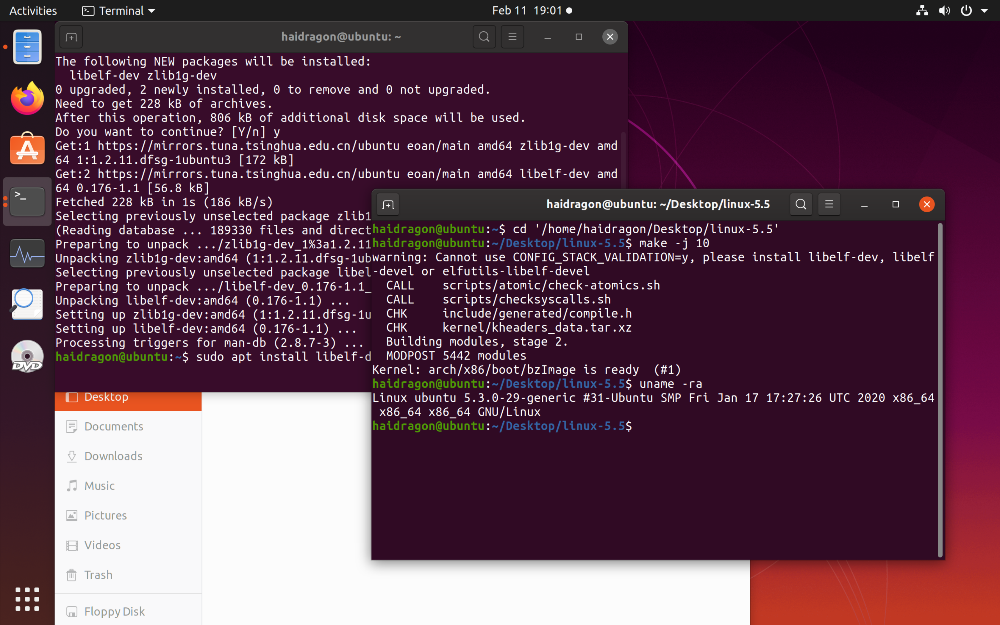
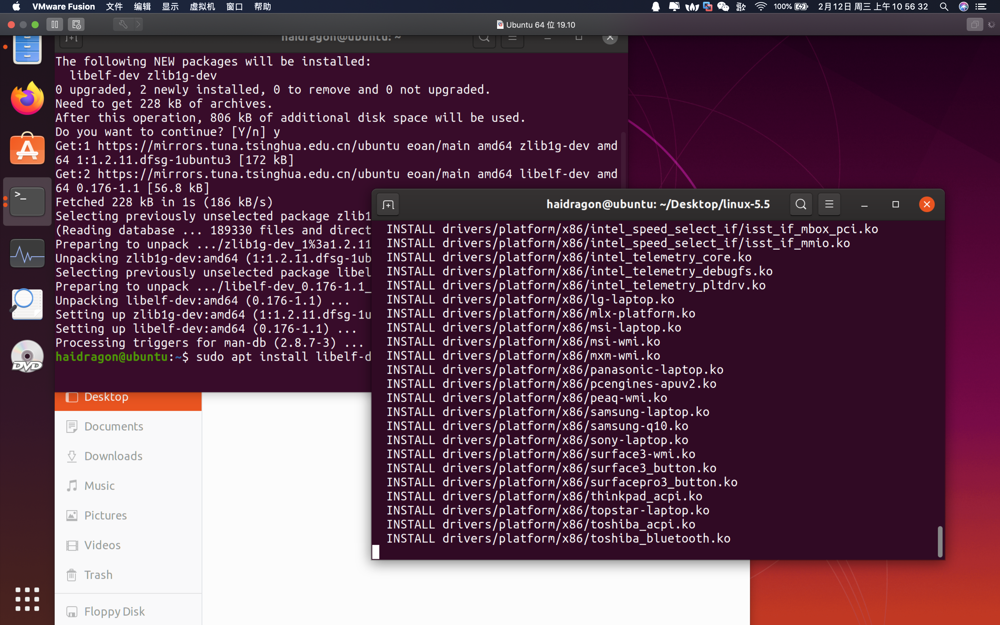
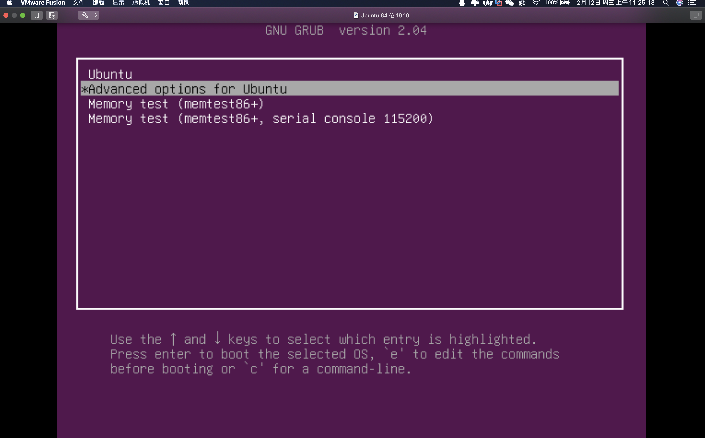
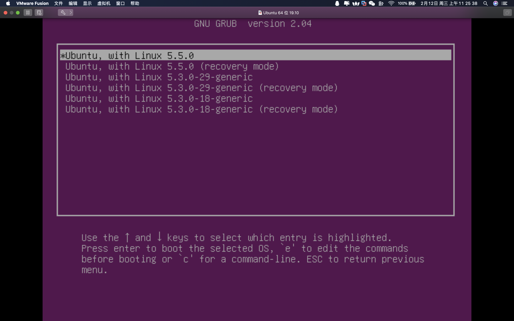

# 第三课 linux内核源码编译

# 视频持续更新.......  
# 其它教程
* study_frida https://github.com/haidragon/study_frida
* study_obscure https://github.com/haidragon/study_obscure
* study_Android_Mchange https://github.com/haidragon/study_Android_Mchange
* qq交流群 
* 309262570
* 有的课题可能没第一时在这写，可以关注我微博 [haidragonx](https://weibo.com/haidragon)同时我也会出其它教程，比如 主动防御(window驱动/linux驱动/mac驱动）、android/ios逆向、流量分析等等 有任何问题。可以联系作者
* qq：2207344074
## 查看完整资料请加入星球

 

