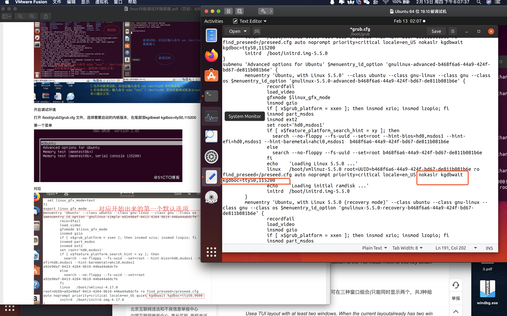

# 第四课 linux内核调试环境搭建(双机调试 mac平台 windows平台)
* 第一步 先设置串口通信

* 第二步 再设置启动项为调试方式
```
打开 /boot/grub2/grub.cfg ⽂件 (版本不同文件名不同 这里是/boot/grub/grub.cfg) 在选项后面加上
nokaslr kgdbwait kgdboc=ttyS0,115200 (nokaslr去掉内核保护随基址)
update-grub （有时更新反而不行，因为运行这句它会把刚刚写的清掉）
reboot 
# nokaslr 查看
$ grep "GRUB_CMDLINE_LINUX_DEFAULT" /etc/default/grub
GRUB_CMDLINE_LINUX_DEFAULT="nokaslr"
# nokaslr 修改方式二 直接修改 /etc/default/grub
gedit /etc/default/grub
```

第三步gdb调试vmlinux
```
make vmlinux(可以不要)
gdb -tui (或者gdb 进去按住Ctrl+x后松开再按a 调出界面）
file vmlinux
set auto-load safe-path xxx/linux
target remote /dev/ttyS0
break start_kernel
break _do_fork
```


## 如果没有设置任何断点想要暂停被调试机运行下面命令
```
su
echo g  >  /proc/sysrq-trigger
```

# Eclipse调试linux内核arm构架

* 如何关闭 [-O2 选项](http://www.lenky.info/archives/2013/03/2238)

* 完整修改成-O0的内核源码下载 https://github.com/figozhang/runninglinuxkernel_4.0
 
