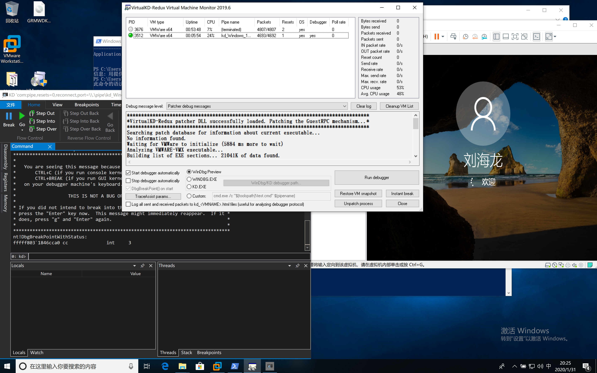

# 第三课 windows内核调试环境搭建(双机调试)
* 驱动开发环境搭建
* 调试环境搭建
1. [VirtualKD](https://github.com/haidragon/VirtualKD-Redux) 方式



2. windbg 串口方式
```
虚拟机设置 串行串口 \\.\pipe\com_1

(被调试机)
打开命令行依次输入 
bcdedit
bcdedit /dbgsettings serial baudrate:115200 debugport:1

C:\Windows\system32>bcdedit /copy {current} /d DebugEntry
已将该项成功复制到 {5da4ee53-44ff-11ea-ac9f-aa2f854a61e3}。

C:\Windows\system32>bcdedit /displayorder {current} {5da4ee53-44ff-11ea-ac9f-aa2f854a61e3}
操作成功完成。

C:\Windows\system32>bcdedit /debug {5da4ee53-44ff-11ea-ac9f-aa2f854a61e3} ON
```
* 可以参考：
* https://blog.csdn.net/sagittarius_warrior/article/details/51305046
* https://www.cnblogs.com/DarkBright/p/10843698.html

3. mac 下如何双虚拟机调试


