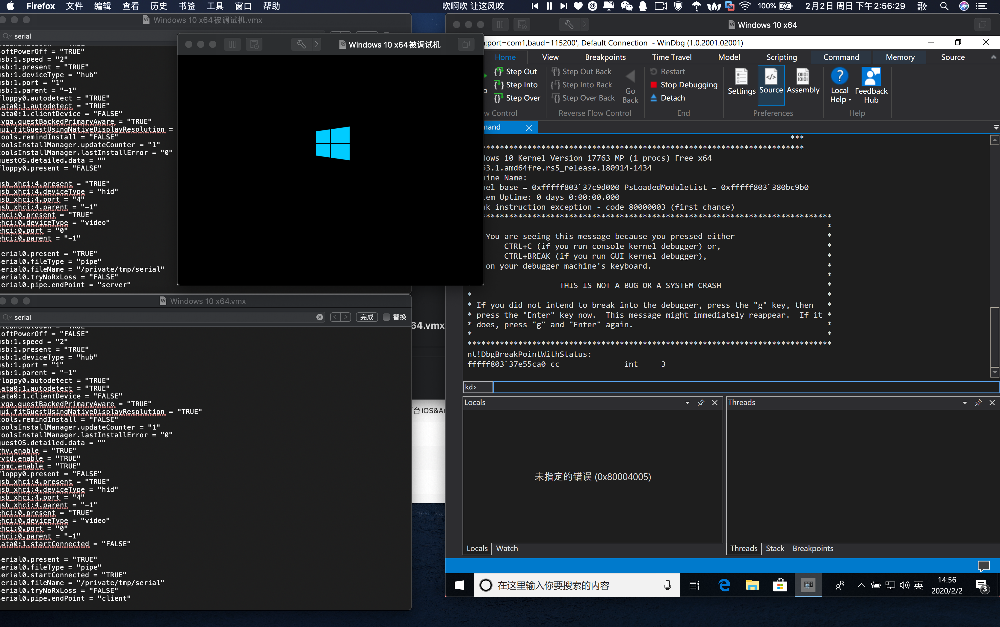

# 第三课 windows内核调试环境搭建(双机调试)
* 驱动开发环境搭建
* 调试环境搭建
1. [VirtualKD](https://github.com/haidragon/VirtualKD-Redux) 方式


2. windbg 串口方式
```
虚拟机设置 串行串口 \\.\pipe\com_1

(被调试机)
打开命令行依次输入 
bcdedit
bcdedit /dbgsettings serial baudrate:115200 debugport:1

C:\Windows\system32>bcdedit /copy {current} /d DebugEntry
已将该项成功复制到 {5da4ee53-44ff-11ea-ac9f-aa2f854a61e3}。

C:\Windows\system32>bcdedit /displayorder {current} {5da4ee53-44ff-11ea-ac9f-aa2f854a61e3}
操作成功完成。

C:\Windows\system32>bcdedit /debug {5da4ee53-44ff-11ea-ac9f-aa2f854a61e3} ON
```
* 可以参考：
* https://blog.csdn.net/sagittarius_warrior/article/details/51305046
* https://www.cnblogs.com/DarkBright/p/10843698.html

3. mac 下如何双虚拟机调试
* 调试虚拟机
* 说明serial0代表com1 依次往下
```
vmx 文件最后加上
serial0.present = "TRUE"
serial0.fileType = "pipe"
serial0.startConnected = "TRUE"
serial0.fileName = "/private/tmp/serial"
serial0.tryNoRxLoss = "FALSE"
serial0.pipe.endPoint = "client"
```

* 被调试虚拟机  
```
serial0.present = "TRUE"
serial0.fileType = "pipe"
serial0.fileName = "/private/tmp/serial"
serial0.tryNoRxLoss = "FALSE"
serial0.pipe.endPoint = "server"

```
* 被调试虚拟机 root 运行cmd（重启）
```
bcdedit /copy {current} /d "debug"
bcdedit /debug ON
bcdedit /bootdebug ON
bcdedit /timeout 10
```
* 打开设备管理 把com1 波特率修改成 115200 俩个虚拟机都要设置
* 被调试机上 开始那右击 运行  运行msconfig 打开启动 进入高级 把刚刚添加的debug 打钩调试 选择对应的com
* 调试机windbg 用com附加（不要打钩pipe）
* 重启被调试机 debug启动（可能没有，没有直接运行windbg也能接收到信息）



* 可以参考：
* https://bbs.pediy.com/thread-222660.htm
* https://blog.csdn.net/chenhuan20123/article/details/78484243
* https://blog.csdn.net/weixin_30532987/article/details/94977818

